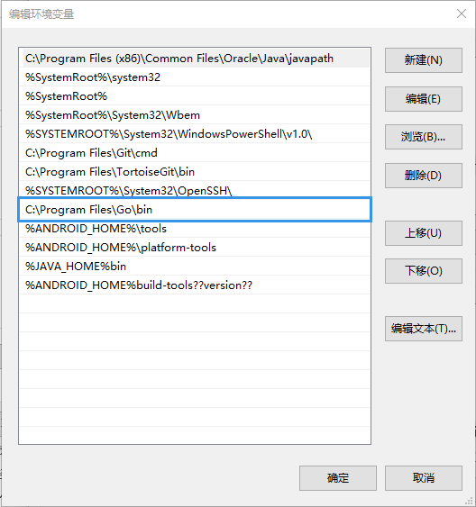
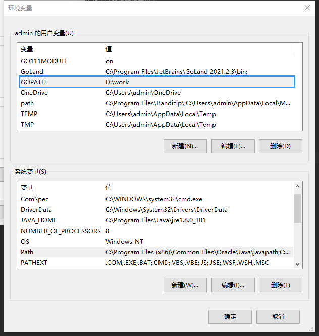

###### 安装与使用

- GOROOT

GOROOT就是go的安装路径
使用go命令或者go工具需要配置go的可执行文件路径环境变量中

以Windows为例
假设Go的安装目录为 C:\Program Files\GO
则 GOROOT为C:\Program Files\GO
将C:\Program Files\GO\bin 添加到$PATH环境变量中

- GOPATH

GOPATH是作为编译后二进制的存放目的地和import包时的搜索路径
go install/go get 和 go的工具等会用到GOPATH环境变量

